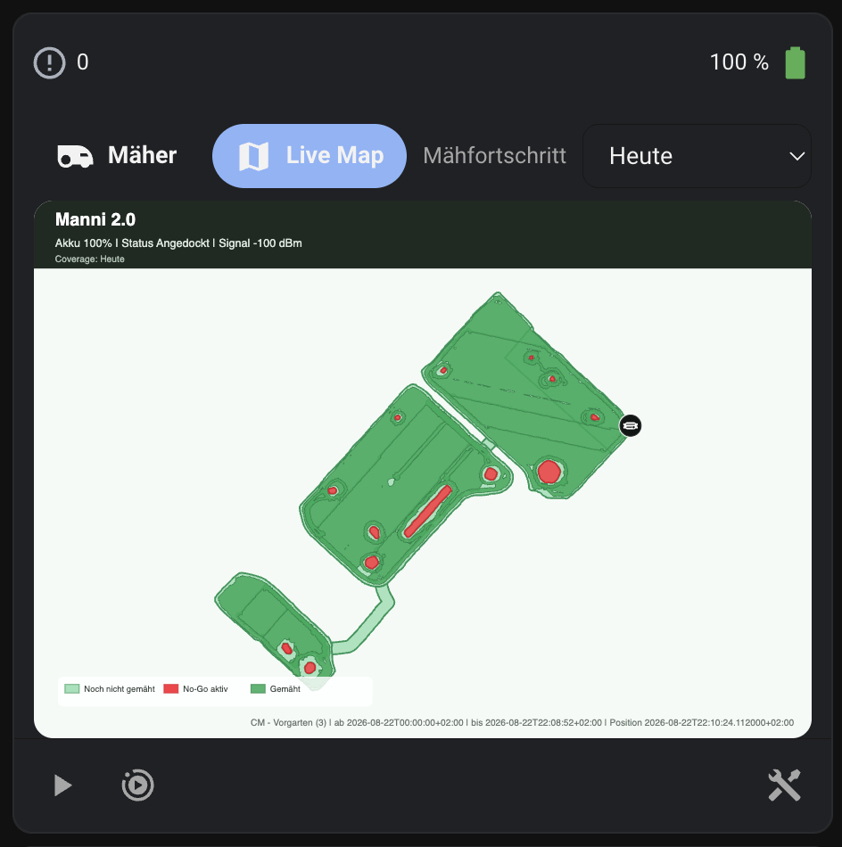

# Kress Fleet Card

A Home Assistant dashboard card for the **Kress Fleet** integration.

Kress Fleet Card wraps the existing [Landroid Card](https://github.com/Barma-lej/landroid-card) and adds Kress Fleet specific functionality:

- switch between mower view and the Kress Fleet Live Map
- select the Live Map coverage period
- automatic English/German labels
- automatic discovery of the Live Map camera and coverage-period selector
- human-readable active zone names from the Kress Fleet zone-name sensor
- suppresses Kress error code `0` as "no error" instead of showing a red `- 0`
- configurable width for Home Assistant Sections dashboards
- visual editor for the main Kress-specific options

> This project is independent and is not affiliated with or endorsed by Kress.

## Requirements

> Kress Fleet integration v0.3.11+ is recommended for localized mower error descriptions.

Before installing this card, install:

1. [HACS](https://www.hacs.xyz/)
2. [Kress Fleet integration](https://github.com/cm86/home-assistant-kress-fleet)
3. [Landroid Card](https://github.com/Barma-lej/landroid-card)

**Landroid Card is a runtime dependency and must be installed separately.**
Its source code and assets are not bundled with Kress Fleet Card.

## Installation with HACS

Kress Fleet Card is currently distributed as a **custom HACS repository**.

### 1. Install Landroid Card

1. Open HACS.
2. Search for **Landroid Card**.
3. Download/install it.
4. Reload the Home Assistant frontend if requested.

### 2. Add Kress Fleet Card as a custom repository

1. Open HACS.
2. Open the menu in the top-right corner.
3. Select **Custom repositories**.
4. Add:

   ```text
   https://github.com/cm86/kress-fleet-card
   ```

5. Select **Dashboard** as the repository type.
6. Add the repository.
7. Open **Kress Fleet Card** in HACS.
8. Download/install it.
9. Hard-refresh/reload the Home Assistant frontend.

HACS should register the JavaScript resource automatically.

If it does not, add this resource manually under **Settings → Dashboards → Resources**:

```text
/hacsfiles/kress-fleet-card/kress-fleet-card.js
```

Resource type: **JavaScript Module**

## Usage

Minimal configuration:

```yaml
type: custom:kress-fleet-card
entity: lawn_mower.your_mower
```

The card automatically tries to find the Kress Fleet Live Map camera and the coverage-period selector belonging to the same Home Assistant device.

It also automatically detects the mower's Kress Fleet `zone_name` sensor and uses its human-readable value in the mower status line instead of numeric labels such as `Zone 2`.

The card can also be added and configured through the Home Assistant visual card editor.

## Live Map example

The Live Map view combines the Kress Fleet map with the mower controls and the selectable coverage period.



## Optional configuration

```yaml
type: custom:kress-fleet-card
entity: lawn_mower.your_mower

# Optional explicit entities. Normally auto-detected.
map_camera: camera.your_mower_live_map
coverage_select: select.your_mower_coverage_period

# Optional zone-name sensor. Normally auto-detected.
zone_name_sensor: sensor.your_mower_zone_name

# Optional error sensor. Normally auto-detected.
error_sensor: sensor.your_mower_error

# mower | map
default_view: mower

# Remember the last selected mower/map view in this browser.
remember_view: true

# auto | 3 | 6 | 9 | 12 | full
grid_columns: full

# Optional maximum Live Map image height.
map_max_height: 700
```

Most normal Landroid Card options can still be passed through the Kress Fleet Card YAML configuration.

## Coverage period

On German Home Assistant installations, the Coverage control is labeled **Mähfortschritt**.

The integration keeps stable internal values such as:

```text
today
last_2_days
last_3_days
...
last_7_days
```

Kress Fleet Card displays localized labels in the UI, for example on German Home Assistant:

```text
Heute
Letzte 2 Tage
Letzte 3 Tage
...
Letzte 7 Tage
```

## Updating

For now, this repository does not require GitHub Releases.

HACS can install and update the card directly from the repository's default branch.

## Troubleshooting

### `Custom element doesn't exist: kress-fleet-card`

Make sure Kress Fleet Card is installed in HACS and that the frontend resource is loaded. Then hard-refresh the browser/app frontend.

### Card waits for `Landroid Card`

Install **Landroid Card** through HACS and ensure its frontend resource is loaded.

### Old JavaScript version is still shown

Hard-refresh the browser or clear the Home Assistant frontend cache.

### Status shows a red `- 0`

Kress Fleet uses error code `0` for **no active error**. Kress Fleet Card
suppresses that zero and restores the normal status color. Real non-zero
errors remain visible and keep the Landroid Card error styling.

## License

Kress Fleet Card is licensed under the MIT License. See [LICENSE](LICENSE).

Landroid Card is a separate runtime dependency and is also distributed under the MIT License. See [THIRD_PARTY_NOTICES.md](THIRD_PARTY_NOTICES.md).
